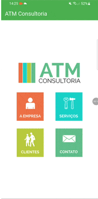

# ATM Consultoria 💼

O **ATM Consultoria** é um aplicativo institucional desenvolvido em **Flutter**. O projeto simula a interface de uma consultoria real, focando em uma experiência de usuário (UX) fluida e uma interface (UI) limpa, utilizando os principais componentes de layout e navegação do framework.

## 📱 Demonstração e Funcionalidades

| Funcionalidades                                                                                                                                                                                                                                                                                                                                                                                                           |                              Demonstração                               |
|:--------------------------------------------------------------------------------------------------------------------------------------------------------------------------------------------------------------------------------------------------------------------------------------------------------------------------------------------------------------------------------------------------------------------------|:-----------------------------------------------------------------------:|
| 🏠 **Página Principal:** Menu intuitivo com navegação rápida.<br><br>🏢 **Empresa:** Histórico e valores da consultoria com layout otimizado.<br><br>🛠️ **Serviços:** Detalhamento das áreas de atuação (Consultoria, Preços e Projetos).<br><br>👥 **Clientes:** Grid de parceiros organizado em duas colunas com `Expanded`.<br><br>📞 **Contato:** Central de atendimento com ícones visuais para e-mail e telefones. |  |

---

## 🛠️ Tecnologias e Conceitos Aplicados

Neste projeto, foram aplicadas diversas boas práticas de desenvolvimento Flutter:

* **Navegação Dinâmica:** Uso de `Navigator.push` para trânsito entre telas.
* **Layouts Complexos:** Organização através de `Column`, `Row`, `Container` e `Padding`.
* **Responsividade:** Uso de `Expanded` para garantir que o grid de clientes se adapte a diferentes tamanhos de tela.
* **Scroll Inteligente:** Implementação de `SingleChildScrollView` para evitar erros de *overflow*.
* **Performance:** Uso estratégico de modificadores `const` e escolha otimizada entre `Stateless` e `Stateful` Widgets.

---

## 📂 Estrutura de Arquivos Principal

* `main.dart`: Ponto de entrada e configuração da Home.
* `menu_empresa.dart`: Tela institucional.
* `menu_servico.dart`: Listagem de serviços.
* `menu_cliente.dart`: Grid de logotipos de clientes.
* `menu_contato.dart`: Informações de contato com ícones nativos.

---

## 🏗️ Como Rodar o Projeto

1.  **Clone o repositório:**
    ```bash
    git clone [https://github.com/seu-usuario/atm_consultoria.git](https://github.com/seu-usuario/atm_consultoria.git)
    ```
2.  **Instale as dependências:**
    ```bash
    flutter pub get
    ```
3.  **Execute o aplicativo:**
    ```bash
    flutter run
    ```

---
<p  style="text-align: center;">Desenvolvido com ❤️ durante os estudos de Flutter</p>